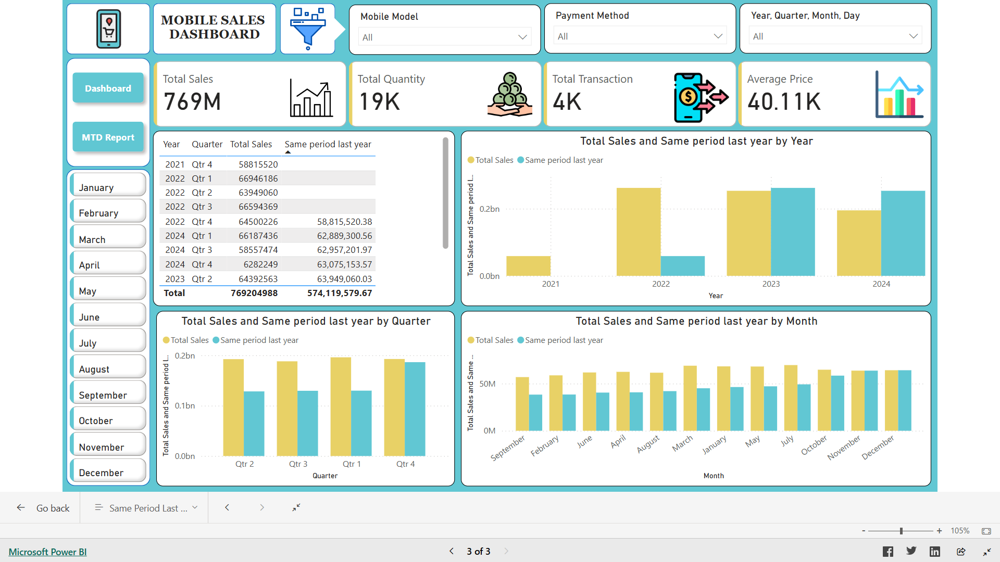
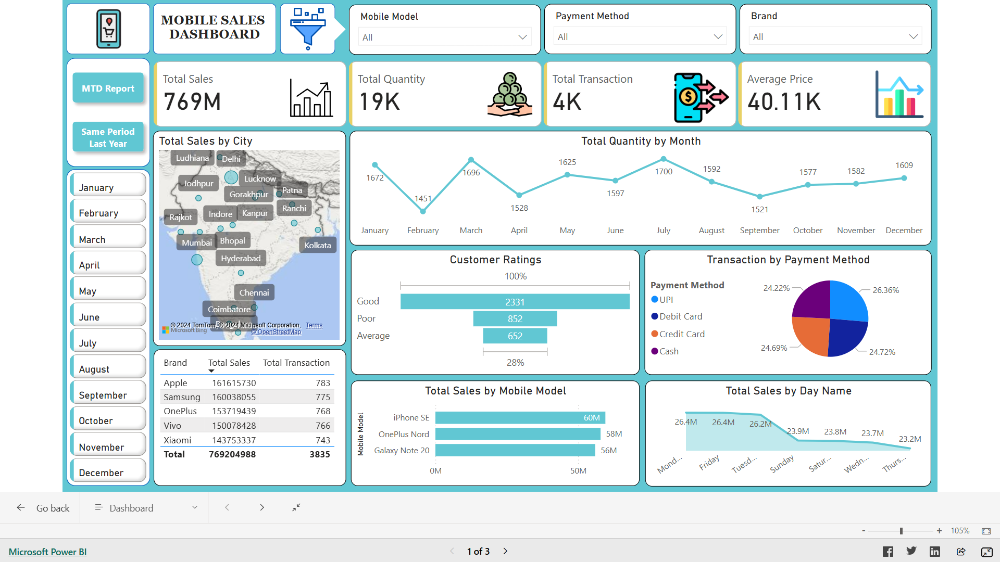
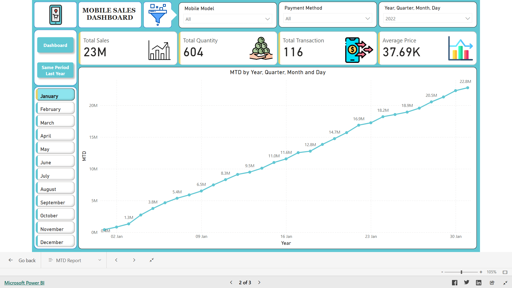

# Mobile Sales Dashboard

## Overview

The Mobile Sales Dashboard is a comprehensive Power BI dashboard designed to provide insights into mobile sales performance. It covers multiple sales metrics and visualizations to help users analyze trends, customer behavior, and payment methods. With additional pages for MTD (Month-to-Date) Report and Same Period Last Year comparisons, it offers an in-depth view of current and past sales data.

## Features

- Overview Metrics
- Total Sales by City
- Monthly Sales Trend
- Customer Ratings
- Transaction by Payment Method
- Top Mobile Brands
- Sales by Mobile Model
- Sales by Day
- MTD Report Page

- Same Period Last Year Page

## 🚀 About Me

🔭 I’m currently working on My Data Science Skills.
🌱 I’m currently learning Data Analytics, Machine Learning.
💬 Ask me about Front-end Development, React, Python, Databases.

## Screenshots

## Acknowledgements

- Thanks to the contributors that made this project possible.
